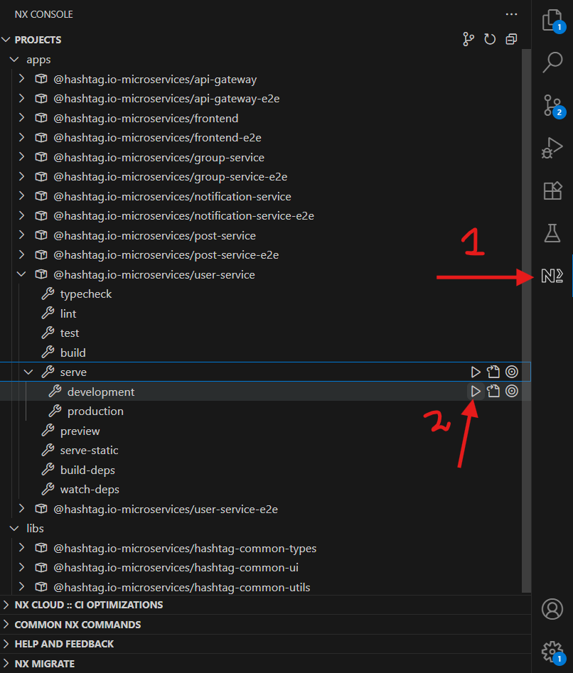

# hashtag.io

<a alt="Nx logo" href="https://nx.dev" target="_blank" rel="noreferrer"></a>

This project is inspired from [Subhajit25Mondal/hashtag.io](https://github.com/Subhajit25Mondal/hashtag.io) and is implemented using the MERN stack with a microservices architecture managed in a monorepo setup.

## Requirements

Latest version of NodeJs, MongoDB, RabbitMQ, and [suggested extensions](./.vscode/extensions.json).

### Install Nx Console

Nx Console is an editor extension that enriches your developer experience. It lets you run tasks, generate code, and improves code autocompletion in your IDE. It is available for VSCode and IntelliJ.

[Install Nx Console &raquo;](https://nx.dev/getting-started/editor-setup?utm_source=nx_project&utm_medium=readme&utm_campaign=nx_projects)

## Directory Structure

```bash
├───.github                  # GitHub-related workflows and configurations
├───.nx                      # Nx workspace files and cache
├───.vscode                  # VSCode workspace settings and recommended extensions
├───apps                     # Contains all application and microservices projects
│   ├───api-gateway          # API Gateway service (entry point for client requests)
│   ├───api-gateway-e2e      # End-to-end tests for API Gateway
│   ├───frontend             # React frontend application
│   ├───frontend-e2e         # End-to-end tests for frontend app
│   ├───group-service        # Microservice handling group-related features
│   ├───group-service-e2e    # E2E tests for group service
│   ├───notification-service # Notification microservice
│   ├───notification-service-e2e
│   ├───post-service         # Service managing posts
│   ├───post-service-e2e
│   ├───user-service         # User management microservice
│   └───user-service-e2e
├───libs                     # Shared libraries used across services and frontend
│   ├───hashtag-common-types # Common TypeScript types/interfaces
│   ├───hashtag-common-ui    # Shared UI components and styles
│   └───hashtag-common-utils # Utility functions used throughout the project
└───node_modules             # Installed Node.js dependencies

```

## Setup Guide

1. Install the [suggested extensions](./.vscode/extensions.json) from extensions panel.
1. Run `npm install` in the project root.
1. You can run each project individually by checking available commands using:

   ```bash
   nx show project <project-name> --web=false

   nx show project frontend --web=false
   nx show project user-service --web=false
   ```

   Or better, use the [Nx Console extension](https://marketplace.visualstudio.com/items?itemName=nrwl.angular-console) to easily browse and run tasks within your IDE.

   

   For an introduction to Nx workspace capabilities, visit the [Nx monorepo tutorial](https://nx.dev/getting-started/tutorials/react-monorepo-tutorial?utm_source=nx_project&utm_medium=readme&utm_campaign=nx_projects) or run:

   ```bash
   nx graph --no-open
   ```

   to visualize project dependencies and architecture.

### How to run Task (Project)?

Here I've given an example on how to run a project without using Nx Console. The example I'm taking is on how to run the [`frontend` project](./apps/frontend/)

1. First view the available targets for each project using `nx show project frontend --web=false`. This gives us brief information about the project and especially the available targets to us

   ```bash
   >>> nx show project frontend --web=false
   Name: @hashtag.io/frontend
   Root: apps/frontend
   Tags: npm:private
   Implicit Dependencies:
   Targets:
   - typecheck:   tsc --build --emitDeclarationOnly
   - build:       react-router build
   - dev:         react-router dev
   - start:       react-router-serve build/server/index.js
   - build-deps:  nx:noop
   - watch-deps:  npx nx watch --projects @hashtag.io/frontend --includeDependentProjects -- npx nx build-deps @hashtag.io/frontend
   - lint:        eslint .
   - test:        jest
   ```

2. Start the development server for the frontend with:

   ```bash
   nx dev frontend
   ```

3. Build a production-ready bundle for the frontend:

   ```bash
   nx build frontend
   ```

Targets are either automatically inferred by Nx or configured in `project.json` or `package.json`.

More about running tasks: [Nx Run Tasks Docs »](https://nx.dev/features/run-tasks?utm_source=nx_project&utm_medium=readme&utm_campaign=nx_projects)

## Add new projects

While you could add new projects to your workspace manually, you might want to leverage [Nx plugins](https://nx.dev/concepts/nx-plugins?utm_source=nx_project&utm_medium=readme&utm_campaign=nx_projects) and their [code generation](https://nx.dev/features/generate-code?utm_source=nx_project&utm_medium=readme&utm_campaign=nx_projects) feature.

Use the plugin's generator to create new projects.

To generate a new application, use:

```sh
npx nx g @nx/react:app demo
```

To generate a new library, use:

```sh
npx nx g @nx/react:lib mylib
```

You can use `npx nx list` to get a list of installed plugins. Then, run `npx nx list <plugin-name>` to learn about more specific capabilities of a particular plugin. Alternatively, [install Nx Console](https://nx.dev/getting-started/editor-setup?utm_source=nx_project&utm_medium=readme&utm_campaign=nx_projects) to browse plugins and generators in your IDE.

[Learn more about Nx plugins &raquo;](https://nx.dev/concepts/nx-plugins?utm_source=nx_project&utm_medium=readme&utm_campaign=nx_projects) | [Browse the plugin registry &raquo;](https://nx.dev/plugin-registry?utm_source=nx_project&utm_medium=readme&utm_campaign=nx_projects)
